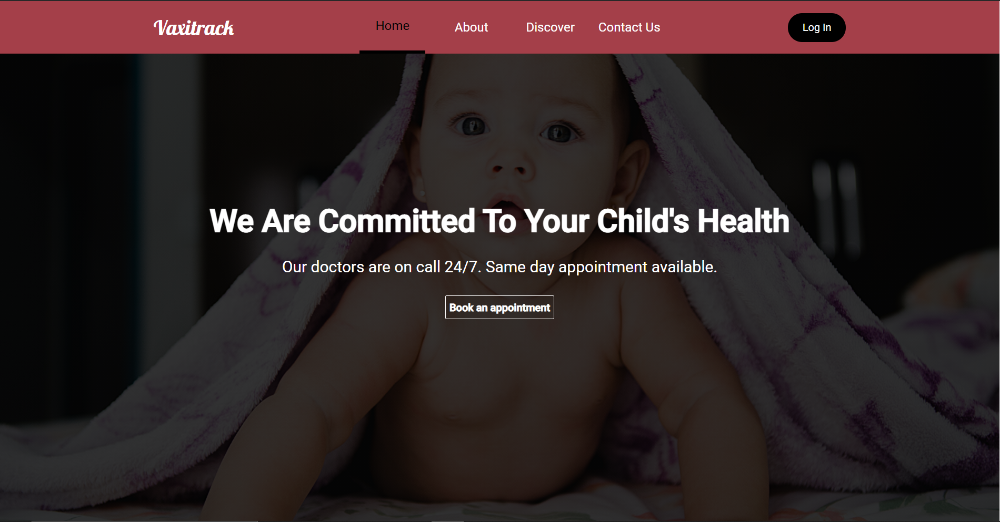
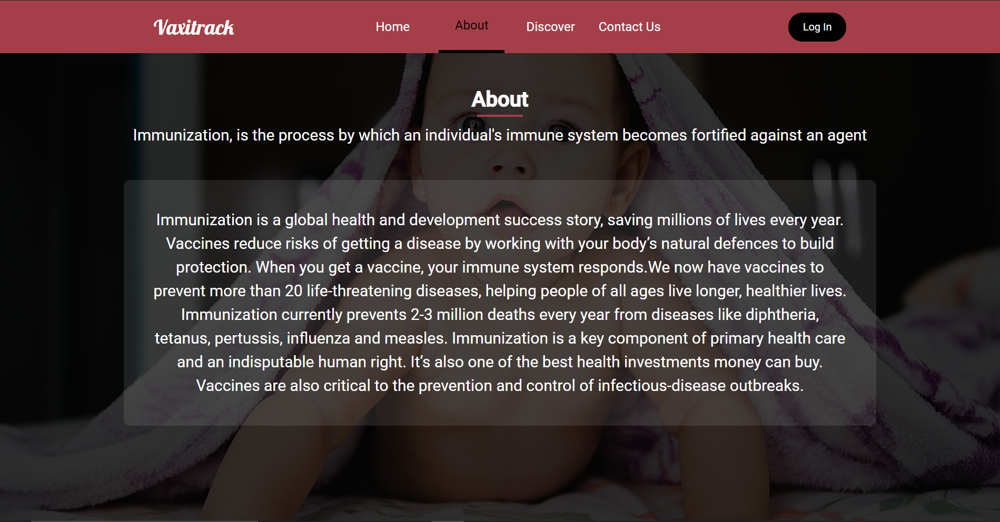
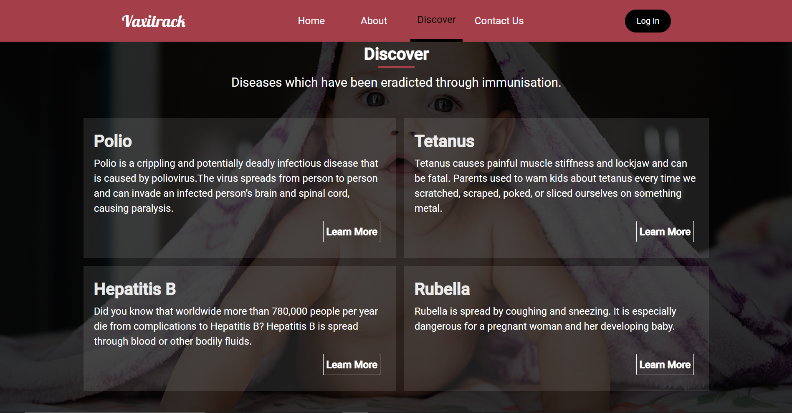
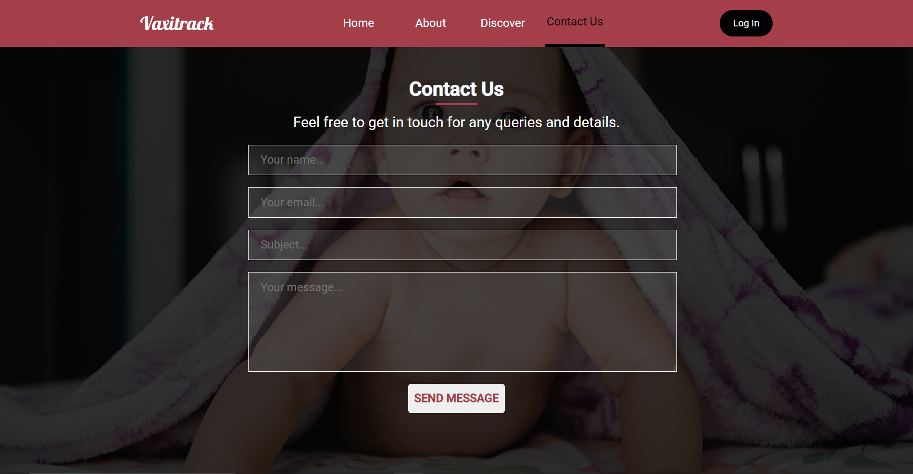
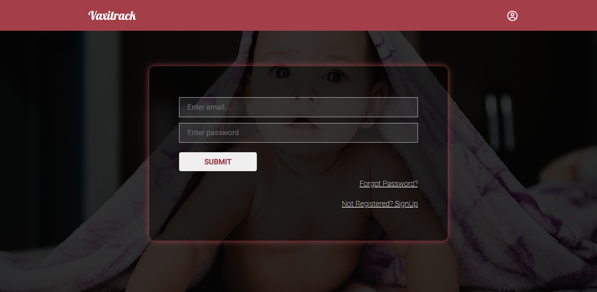
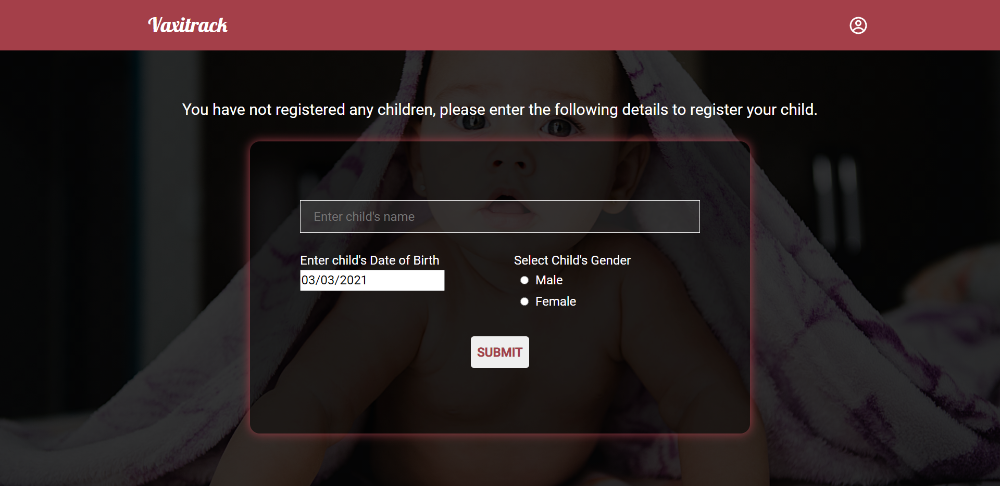
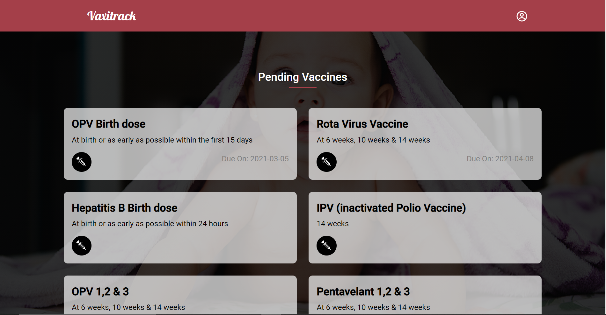
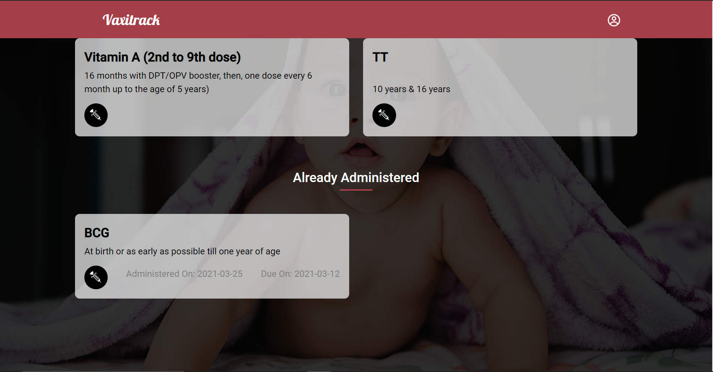
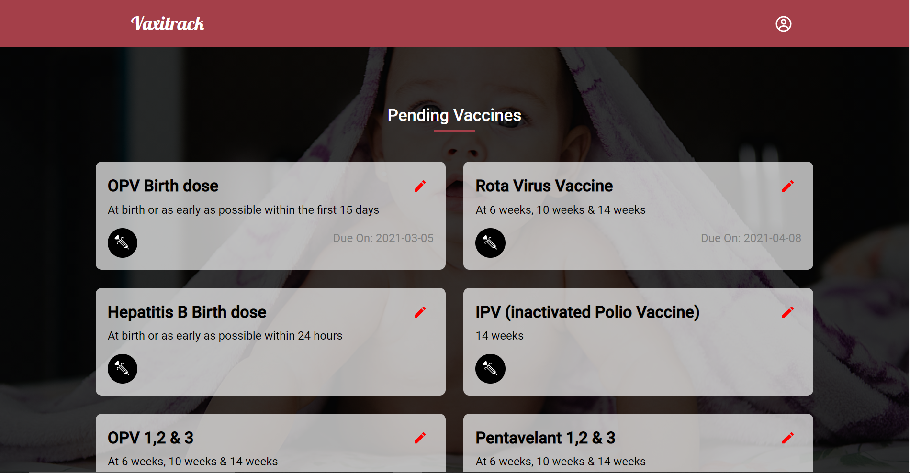
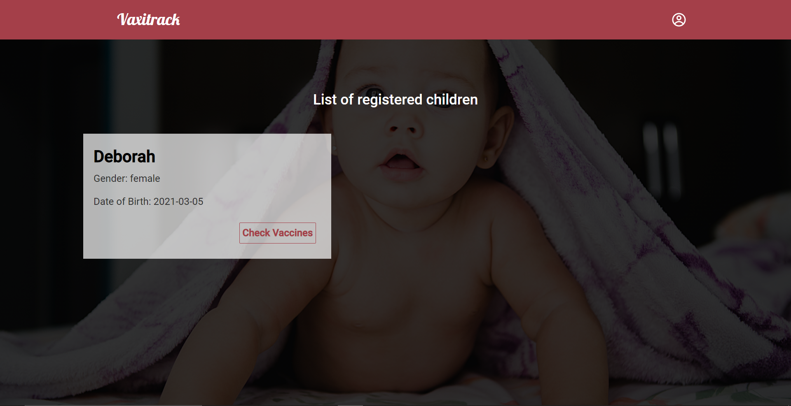

<!-- PROJECT LOGO -->
<p align="center">
  <h3 align="center">Vaxitrack</h3>
  <p align="center">
    A website built to enable doctors and parents keep track of vaccination records
  </p>
</p>

<!-- TABLE OF CONTENTS -->
<details open="open">
  <summary>Table of Contents</summary>
  <ol>
    <li>
      <a href="#about-the-project">About The Project</a>
      <ul>
        <li><a href="#built-with">Built With</a></li>
      </ul>
    </li>
    <li>
      <a href="#getting-started">Getting Started</a>
      <ul>
        <li><a href="#installation">Installation</a></li>
      </ul>
    </li>
    <li>
      <a href="#usage-and-screenshots">Usage and Screenshots</a>
      <ul>
        <li><a href="#home-page-screenshots">Home Page Screenshots</a></li>
        <li><a href="#client-side-screenshots">Client Side Screenshots</a></li>
        <li><a href="#admin-side-screenshots">Admin Side Screenshots</a></li>
      </ul>
    </li>
    <li><a href="#license">License</a></li>
  </ol>
</details>


<!-- ABOUT THE PROJECT -->
## About The Project
This project was created keeping in mind the difficulty faced in keeping track with paper records. It is a website which helps doctors to view their patients vaccination records 
in a systematic way and helps parents to keep a track of thier children's vaccination records, i.e, 2 different types of systems(admin and user) are implemented. 

Working:
* Parents are allowed to signup and register their children
* All registered children are viewable to the doctor
* The doctor is given the freedom the modify the due date and date of administration of the vaccine
* The vaccine records are displayed to the user for hastle free record keeping


### Built With

* MongoDB
* Express
* React/Redux 
* Node.js
* Styled Components


<!-- GETTING STARTED -->
## Getting Started

### Installation

1. Clone the repo
   ```sh
   git clone https://github.com/your_username_/Project-Name.git
   ```
2. Install yarn packages
   ```sh
   yarn install
   ```
4. Create env files in the client and backend folders following the .env example naming conventions
5. To run the backend
   ```sh
   cd backend 
   nodemon server.js
   ```
6. To run the frontend
   ```sh
   cd client
   yarn start
   ```


<!-- USAGE EXAMPLES -->
## Usage and Screenshots
### Home Page Screenshots




<br>

### Client Side Screenshots






### Admin Side Screenshots
The admin side features a similar layout with an additional feature to update the vaccine infomation of a patient
<br>



<!-- LICENSE -->
## License
Distributed under the MIT License. See `LICENSE` for more information.


